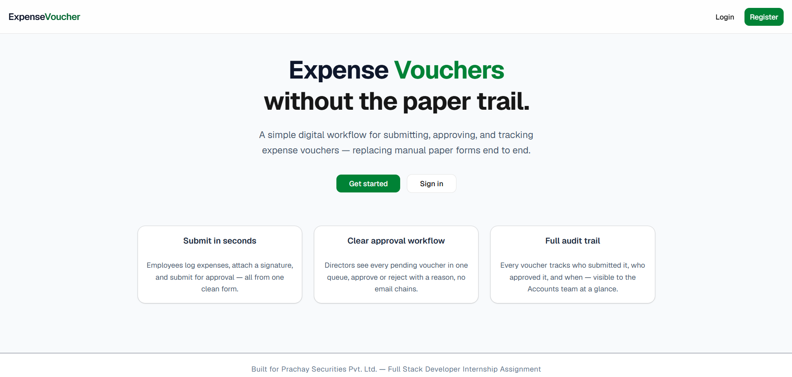
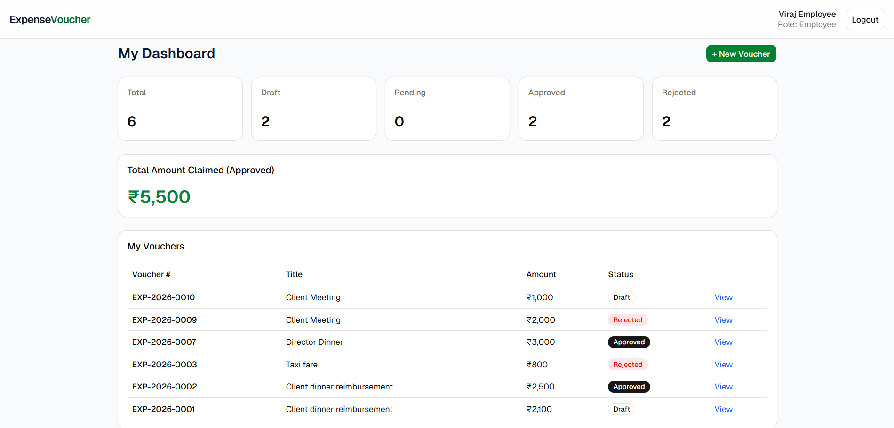
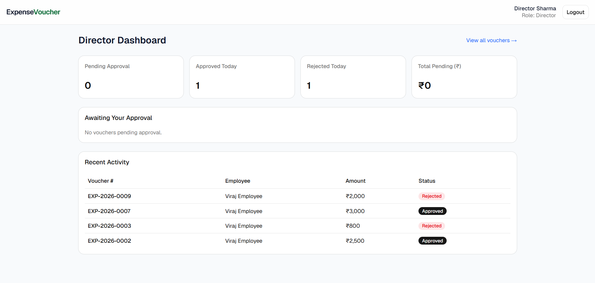
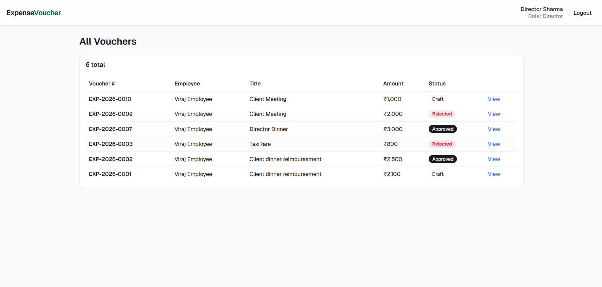
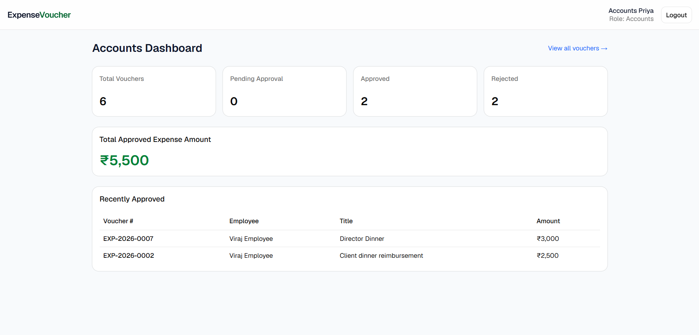
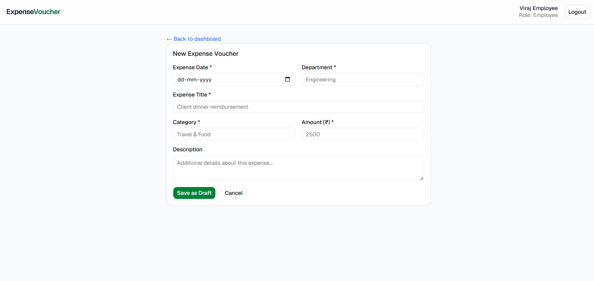

# Expense Voucher Management System

A full-stack web application replacing a manual paper-based expense voucher approval process, built for Prachay Securities Pvt. Ltd.'s Full Stack Developer Internship assignment.

## Tech Stack

**Frontend:** React 19 (Vite) + TypeScript, Tailwind CSS v4, shadcn/ui (Base UI)
**Backend:** Node.js, Express 5, MongoDB + Mongoose 9
**Auth:** JWT (access + refresh tokens)
**File Storage:** Cloudinary (signature images)

## Project Structure
expense-tracker/
├── backend/     # Express API
├── frontend/    # React app
└── README.md

## Setup Instructions

### Backend

```bash
cd backend
npm install
cp .env.example .env   # fill in your own values
npm run dev
```

Runs on `http://localhost:8000`.

### Frontend

```bash
cd frontend
npm install
cp .env.example .env
npm run dev
```

Runs on `http://localhost:5173`.

### Environment Variables

**backend/.env**

PORT=8000
MONGODB_URI=mongodb+srv://<username>:<password>@<cluster>.mongodb.net
DB_NAME=expense_voucher_db
CORS_ORIGIN=http://localhost:5173
ACCESS_TOKEN_SECRET=<random-secret>
ACCESS_TOKEN_EXPIRY=1d
REFRESH_TOKEN_SECRET=<random-secret>
REFRESH_TOKEN_EXPIRY=10d
CLOUDINARY_CLOUD_NAME=<your-cloud-name>
CLOUDINARY_API_KEY=<your-api-key>
CLOUDINARY_API_SECRET=<your-api-secret>
NODE_ENV=development

**frontend/.env**

VITE_API_BASE_URL=http://localhost:8000/api/v1

## User Roles

| Role | Capabilities |
|---|---|
| **Employee** | Create, edit, delete draft vouchers. Submit with signature. View own vouchers and dashboard. |
| **Director** | View all vouchers. Approve (with signature) or reject (with reason) pending vouchers. View director dashboard. |
| **Accounts** | View all vouchers and org-wide dashboard. Read-only — cannot create, edit, approve, or reject. |

Registration is open — select your role when creating an account.

## Database Schema

### User

| Field | Type | Notes |
|---|---|---|
| name | String | required |
| email | String | required, unique |
| password | String | required, bcrypt hashed |
| role | String | enum: employee / director / accounts |
| employeeId | String | optional |
| department | String | |
| refreshToken | String | set on login |

### Voucher

| Field | Type | Notes |
|---|---|---|
| voucherNumber | String | auto-generated, unique (e.g. EXP-2026-0001) |
| voucherDate | Date | defaults to creation date |
| expenseDate | Date | required |
| department | String | required |
| expenseTitle | String | required |
| expenseCategory | String | required |
| expenseDescription | String | optional |
| amount | Number | required, must be > 0 |
| employee | ObjectId (ref: User) | required |
| employeeSignature | String | Cloudinary URL, required before submit |
| status | String | enum: draft / pending_approval / approved / rejected |
| director | ObjectId (ref: User) | set on approve/reject |
| directorSignature | String | Cloudinary URL, required on approve |
| approvalDate | Date | set on approve |
| rejectionReason | String | required on reject |
| createdAt / updatedAt | Date | automatic (audit trail) |

### Counter

Internal collection used to atomically generate sequential voucher numbers per year, avoiding race conditions under concurrent submissions.

## API Documentation

### Auth — `/api/v1/auth`

| Method | Endpoint | Access | Description |
|---|---|---|---|
| POST | `/register` | Public | Register a new user |
| POST | `/login` | Public | Login, returns access + refresh tokens |
| POST | `/logout` | Authenticated | Clears tokens |
| POST | `/refresh-token` | Public (valid refresh token) | Issues new access token |

### Vouchers — `/api/v1/vouchers`

| Method | Endpoint | Access | Description |
|---|---|---|---|
| POST | `/` | Employee | Create a draft voucher |
| GET | `/my-vouchers` | Employee | Get own vouchers |
| PATCH | `/:voucherId` | Employee | Edit a draft voucher |
| DELETE | `/:voucherId` | Employee | Delete a draft voucher |
| PATCH | `/:voucherId/submit` | Employee | Submit for approval (multipart, `employeeSignature` file) |
| PATCH | `/:voucherId/approve` | Director | Approve (multipart, `directorSignature` file) |
| PATCH | `/:voucherId/reject` | Director | Reject (JSON, `rejectionReason`) |
| GET | `/` | Director, Accounts | Get all vouchers — query params: `status`, `department`, `expenseCategory`, `search`, `dateFrom`, `dateTo`, `amountMin`, `amountMax`, `sortBy`, `sortOrder` |
| GET | `/:voucherId` | Employee (own only), Director, Accounts | Get voucher details |

### Dashboard — `/api/v1/dashboard`

| Method | Endpoint | Access | Description |
|---|---|---|---|
| GET | `/employee` | Employee | Own voucher stats + total approved amount claimed |
| GET | `/director` | Director | Pending count, approved/rejected today, total pending amount, recent activity |
| GET | `/accounts` | Accounts | Org-wide counts, total approved amount, recently approved vouchers |

## Frontend Routes

| Path | Access | Page |
|---|---|---|
| `/` | Public | Landing page |
| `/login`, `/register` | Public (redirects if already logged in) | Auth |
| `/employee/dashboard` | Employee | Dashboard + voucher list |
| `/employee/vouchers/new` | Employee | Create voucher |
| `/employee/vouchers/:id` | Employee | View/edit/submit/delete voucher |
| `/director/dashboard` | Director | Dashboard + pending queue |
| `/director/vouchers` | Director | All vouchers |
| `/director/vouchers/:id` | Director | Approve/reject voucher |
| `/accounts/dashboard` | Accounts | Dashboard |
| `/accounts/vouchers` | Accounts | All vouchers (read-only) |

## Assumptions Made

1. **Collapsed workflow states:** the spec's diagram shows Submitted → Pending Approval as two steps; since they carry no distinct behavior, they're modeled as a single `pending_approval` status.
2. **Open registration:** any user can self-register with any role. In production, role assignment would be admin-controlled — kept open here to make evaluation/testing fast.
3. **Rejected-today metric:** since the schema has no dedicated rejection-date field, the Director dashboard's "Rejected Today" uses `updatedAt`, which reflects the moment of rejection given the current controller logic.
4. **Signature enforcement:** conditional-required rules (employee signature before submit, director signature before approve, rejection reason before reject) are enforced at the controller level, not the schema level.
5. **Future-dated expenses blocked:** the frontend prevents selecting an expense date later than today, since an expense shouldn't be filed before it occurs.

## Tech Notes

- Backend runs on **Mongoose 9** and **Express 5** — both recent major versions with some breaking changes from older tutorials (e.g. Mongoose 9 removed the `next` callback from schema hooks in favor of plain async functions).
- Frontend uses Tailwind v4's CSS-first config (no `tailwind.config.js`) and shadcn/ui's Base UI variant.

## Screenshots

### Landing Page


### Employee Dashboard


### Director Dashboard


### Voucher Detail


### Accounts Dashboard


### Create a Voucher
